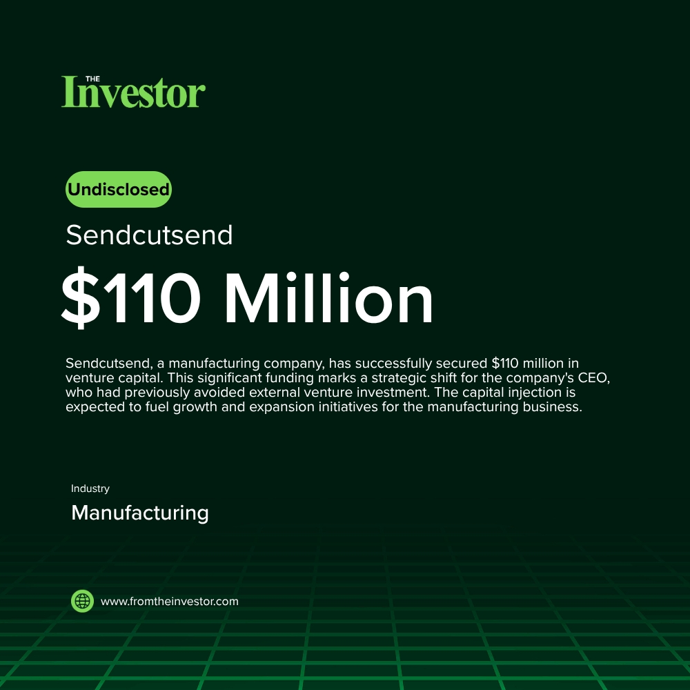

# Daily News Report (2026-05-20)

> Curated from TechCrunch and Hacker News. Contains 3 fundraising deals.
> Generated automatically via GitHub Actions.

---

## 1. Sendcutsend: $110 Million Undisclosed Round

- **Summary**: Sendcutsend, a manufacturing company, has successfully secured $110 million in venture capital. This significant funding marks a strategic shift for the company's CEO, who had previously avoided external venture investment. The capital injection is expected to fuel growth and expansion initiatives for the manufacturing business.
- **Key Points**:
  1. Investors: Undisclosed
  2. Sector keywords: manufacturing, venture capital, growth equity, industrial tech
- **Source**: [WSJ](https://www.wsj.com/business/entrepreneurship/this-manufacturing-ceo-once-spurned-venture-capital-now-hes-taking-110-million-82f7aafb)
- **Generated Card**: [View Rendered Image](https://templated-assets.s3.amazonaws.com/render/05a753c8-b866-48a7-8f73-f09dd3044603.jpg)

- **Keywords**: `manufacturing` `venture capital` `growth equity` `industrial tech`
- **Score**: ⭐⭐⭐⭐⭐ (5/5)

---

## 2. Status AI: $17 Million Undisclosed Round

- **Summary**: Status AI is an innovative platform transforming social media from passive feeds into interactive entertainment. It aims to immerse users in stories rather than merely watching them, catering to the next generation's desire for deeper engagement. This funding will support its mission to usher in a new era of social networking.
- **Key Points**:
  1. Investors: Undisclosed
  2. Sector keywords: social media, AI, interactive entertainment, gamification
- **Source**: [TechCrunch](https://techcrunch.com/2026/05/19/gamified-social-media-network-status-announces-17m-funding-to-help-usher-in-new-era-of-social-networking/)
- **Keywords**: `social media` `AI` `interactive entertainment` `gamification`
- **Score**: ⭐⭐⭐⭐ (4/5)

---

## 3. Stilta: $10.5 Million Seed

- **Summary**: Stilta is an AI platform designed to automate the labor-intensive research and analytical work involved in intellectual property cases. The company aims to make patent litigation faster, more efficient, and less expensive by helping companies rediscover and leverage forgotten patents within their portfolios.
- **Key Points**:
  1. Investors: a16z, YC
  2. Sector keywords: legal tech, AI, intellectual property, patent management
- **Source**: [TechCrunch](https://techcrunch.com/2026/05/19/legal-tech-announced-stilta-announces-10m-seed-backed-by-yc-and-a16z-months-after-launch/)
- **Keywords**: `legal tech` `AI` `intellectual property` `patent management`
- **Score**: ⭐⭐⭐⭐ (4/5)

---

*Generated by Daily News Report v3.0*
