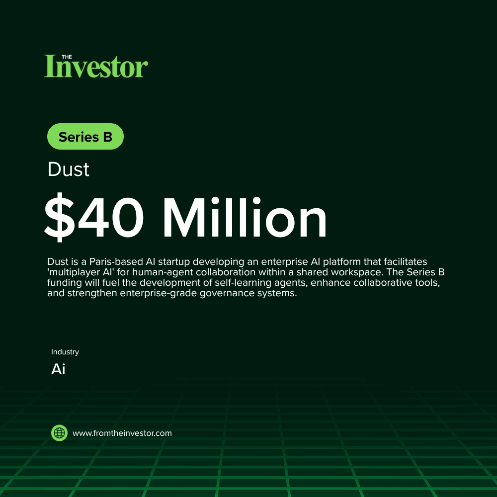

# Daily News Report (2026-05-21)

> Curated from TechCrunch and Hacker News. Contains 3 fundraising deals.
> Generated automatically via GitHub Actions.

---

## 1. Dust: $40 Million Series B

- **Summary**: Dust is a Paris-based AI startup developing an enterprise AI platform that facilitates 'multiplayer AI' for human-agent collaboration within a shared workspace. The Series B funding will fuel the development of self-learning agents, enhance collaborative tools, and strengthen enterprise-grade governance systems.
- **Key Points**:
  1. Investors: Sequoia, Abstract, Snowflake, Datadog
  2. Sector keywords: AI, enterprise AI, human-agent collaboration, SaaS
- **Source**: [Sifted](https://sifted.eu/articles/sequoia-dust-40m-series-b-ai-agents)
- **Generated Card**: [View Rendered Image](https://templated-assets.s3.amazonaws.com/render/85901290-3651-473a-a246-56cb721ee372.jpg)

- **Keywords**: `AI, enterprise AI, human-agent collaboration, SaaS`
- **Score**: ⭐⭐⭐⭐ (4/5)

---

## 2. Boston Metal: $75 Million Funding Round

- **Summary**: Boston Metal, a technology company focused on sustainable metals production, has raised $75 million to scale its Molten Oxide Electrolysis (MOE) platform. This capital infusion will accelerate the deployment of its technology for the production of critical metals such as niobium, tantalum, vanadium, and nickel, contributing to decarbonization efforts and securing supply chains.
- **Key Points**:
  1. Investors: Tata Steel Limited, Climate Investment, existing investors
  2. Sector keywords: greentech, metals production, decarbonization, critical minerals
- **Source**: [GlobeNewswire](https://vertexaisearch.cloud.google.com/grounding-api-redirect/AUZIYQGLCJBHKff3X8-EF1W0Y6hKjVqgErfXkmGKZ3fGrgsZsulKppZa8FK4EToFtrlb-4HQWiPMD5pyar9Gxl-n897iMO3vqqztH8mddyodllZbyj4AG3TtGUJvBRIN35QVWQ9cdKOtgamMs0giIgcOLcOTPHavkRfrLms-hJZu3b1kVkBc3iK6poYJ-QfdDi4zoNzGRFgvmqIYCF-93v4yK4kSFUH2Dt2D3ZJWvSPjqaZ8DDM9vVue06Pj5ugp7KFRTz4Uw_w=)
- **Keywords**: `greentech, metals production, decarbonization, critical minerals`
- **Score**: ⭐⭐⭐⭐ (4/5)

---

## 3. Imperagen: £5 million ($6.7 million) Seed Round

- **Summary**: Imperagen is a biotech company specializing in enzyme engineering, leveraging quantum physics and artificial intelligence to redefine how enzymes are designed and optimized. This seed funding will be used to advance its proprietary platform and accelerate product development.
- **Key Points**:
  1. Investors: PXN Ventures, IQ Capital, Northern Gritstone
  2. Sector keywords: biotech, enzyme engineering, AI, quantum physics
- **Source**: [TechCrunch](https://techcrunch.com/2026/05/20/imperagen-raises-5-million-to-redefine-enzyme-engineering/)
- **Keywords**: `biotech, enzyme engineering, AI, quantum physics`
- **Score**: ⭐⭐⭐ (3/5)

---

*Generated by Daily News Report v3.0*
