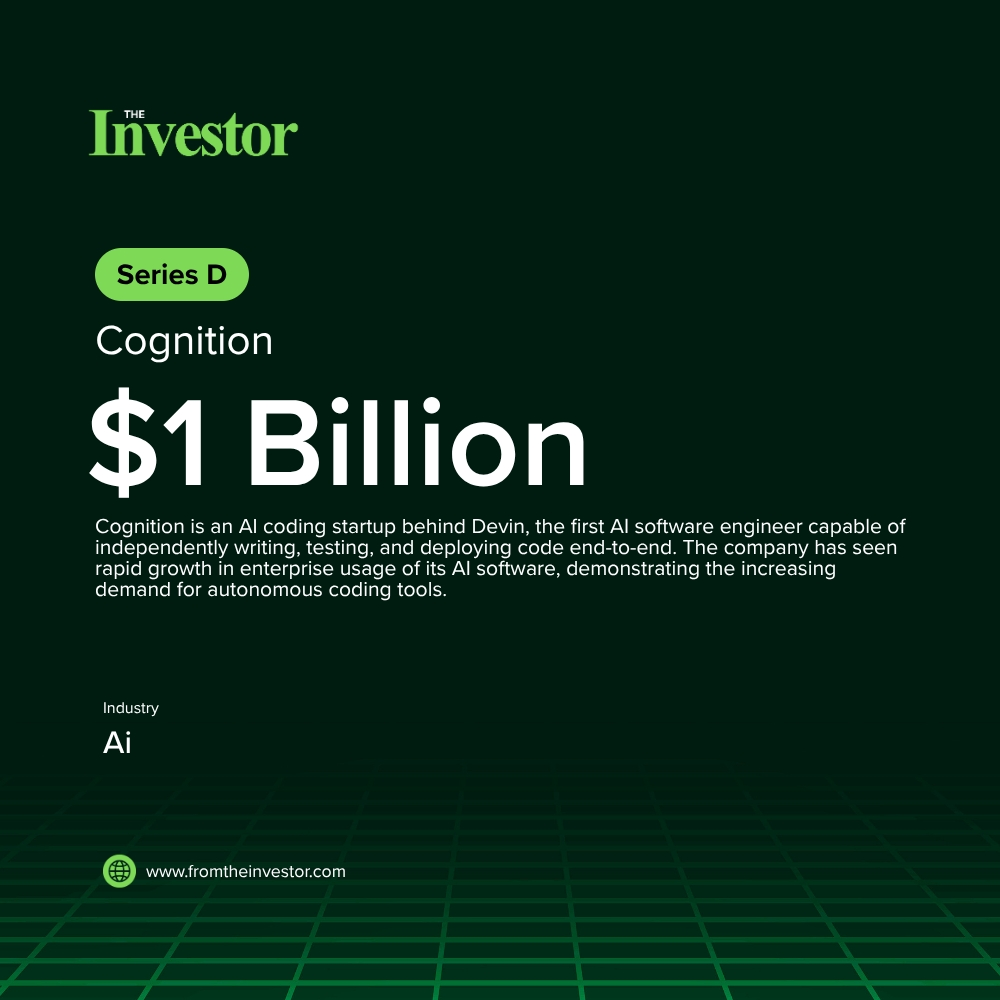

# Daily News Report (2026-05-28)

> Curated from TechCrunch and Hacker News. Contains 3 fundraising deals.
> Generated automatically via GitHub Actions.

---

## 1. Cognition: $1 Billion Series D at $26 Billion Valuation

- **Summary**: Cognition is an AI coding startup behind Devin, the first AI software engineer capable of independently writing, testing, and deploying code end-to-end. The company has seen rapid growth in enterprise usage of its AI software, demonstrating the increasing demand for autonomous coding tools.
- **Key Points**:
  1. Investors: Lux Capital, General Catalyst, 8VC, Founders Fund, Elad Gil, Alpha Wave, Bain Capital Ventures, Vitruvian, Definition Capital, Conversion Capital, 137 Ventures, Ribbit Capital, Atreides, Layer Global
  2. Sector keywords: AI, coding, software development, generative AI
- **Source**: [Hacker News](https://www.bloomberg.com/news/articles/2026-05-27/ai-coding-startup-cognition-raises-1-billion-at-26-billion-value)
- **Generated Card**: [View Rendered Image](https://templated-assets.s3.amazonaws.com/render/fbe0a793-f0cd-4194-8c86-10567d82611c.jpg)

- **Keywords**: `AI` `coding` `software development` `generative AI`
- **Score**: ⭐⭐⭐⭐⭐ (5/5)

---

## 2. Thea Energy: $100 Million Series B Funding

- **Summary**: Thea Energy is a company focused on building scalable fusion power plants, utilizing stellarator-based fusion systems. This funding will support the expansion of their magnet manufacturing capacity, construction of an integrated fusion system, and acceleration towards commercial deployment of fusion energy.
- **Key Points**:
  1. Investors: US Innovative Technology Fund, Emerald Technology Ventures, General Innovation Capital Partners, Linse Capital, Calm Ventures, Climate Capital, Divergent Capital, Gaingels, Idemitsu Kosan, Overlay Capital, Timescale Ventures, Whatif Ventures, Hitachi Ventures, Lowercarbon Capital, Prelude Ventures, Alumni Ventures, Mercator Partners, Orion Industrial Ventures, Starlight Ventures
  2. Sector keywords: cleantech, fusion energy, deep tech, energy
- **Source**: [Hacker News](https://thea.energy/press-release/thea-energy-raises-100-million-series-b-funding-to-build-scalable-fusion-power-plants/)
- **Keywords**: `cleantech` `fusion energy` `deep tech` `energy`
- **Score**: ⭐⭐⭐⭐ (4/5)

---

## 3. Triomics: $22 Million Series B

- **Summary**: Triomics is an AI company focused on oncology, aiming to bring AI solutions specifically designed for cancer centers. It helps cancer centers leverage AI to improve patient care and operational efficiency.
- **Key Points**:
  1. Investors: Battery Ventures
  2. Sector keywords: healthtech, AI, oncology
- **Source**: [TechCrunch](https://techcrunch.com/2026/05/27/triomics-nabs-22m-to-bring-oncology-specific-ai-to-cancer-centers/)
- **Keywords**: `healthtech` `AI` `oncology`
- **Score**: ⭐⭐⭐ (3/5)

---

*Generated by Daily News Report v3.0*
