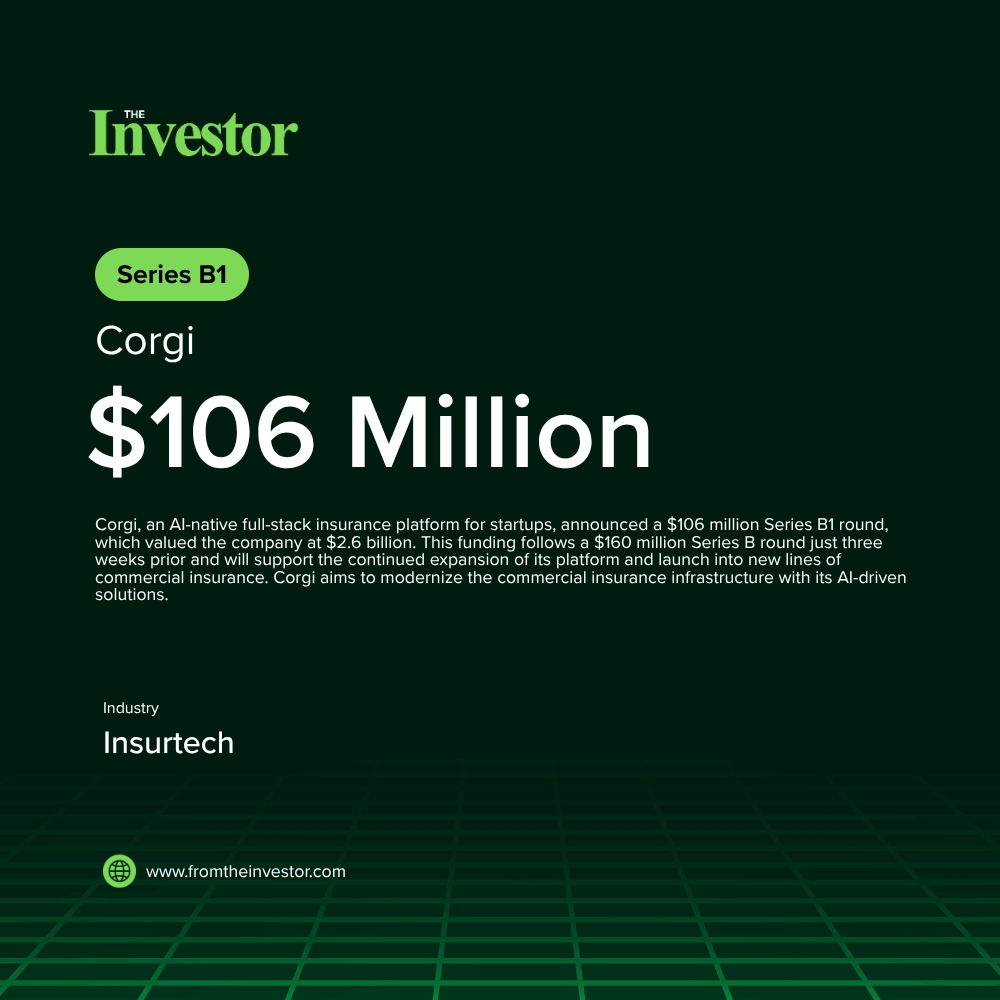

# Daily News Report (2026-05-29)

> Curated from TechCrunch and Hacker News. Contains 4 fundraising deals.
> Generated automatically via GitHub Actions.

---

## 1. Corgi: $106 Million Series B1 at $2.6 Billion valuation

- **Summary**: Corgi, an AI-native full-stack insurance platform for startups, announced a $106 million Series B1 round, which valued the company at $2.6 billion. This funding follows a $160 million Series B round just three weeks prior and will support the continued expansion of its platform and launch into new lines of commercial insurance. Corgi aims to modernize the commercial insurance infrastructure with its AI-driven solutions.
- **Key Points**:
  1. Investors: TCV (lead), Prime Capital, Zone 2 Ventures, Oliver Jung, Leblon Capital, Kindred Ventures, Quadri Ventures, First Order Fund, Vocal Ventures, Nordstar, GSBackers, Repeat Ventures, 8188 Capital
  2. Sector keywords: insurtech, AI, commercial insurance, fintech
- **Source**: [TechCrunch](https://techcrunch.com/2026/05/28/corgi-announces-106m-raise-at-2-6b-valuation-three-weeks-after-160m-series-b/)
- **Generated Card**: [View Rendered Image](https://templated-assets.s3.amazonaws.com/render/bd02a3c3-5d71-4aa3-b22a-6ac86ff2f10e.jpg)

- **Keywords**: `insurtech` `AI` `commercial insurance` `fintech`
- **Score**: ⭐⭐⭐⭐⭐ (5/5)

---

## 2. Anthropic: $65 Billion Series H funding at $965 Billion post-money valuation

- **Summary**: Anthropic, a generative AI company, raised $65 billion in Series H funding, achieving a post-money valuation of $965 billion. This substantial investment, which positions Anthropic as a leading AI firm, will be used to advance safety and interpretability research, expand compute capacity for its Claude models, and scale products and partnerships.
- **Key Points**:
  1. Investors: Altimeter Capital (lead), Dragoneer (lead), Greenoaks (lead), Sequoia Capital (lead), Capital Group (co-lead), Coatue (co-lead), D1 Capital Partners (co-lead), GIC (co-lead), ICONIQ (co-lead), XN (co-lead), AMP PBC, Baillie Gifford, Blackstone, Brookfield, D.E. Shaw Ventures, DST Global, Fidelity Management & Research Company, General Catalyst, Insight Partners, Jane Street, Lightspeed Venture Partners, MGX, NTTVC, NX1 Capital, Situational Awareness LP, T. Rowe Price Associates, Inc., T. Rowe Price Investment Management, Inc., Temasek, Amazon, Micron, Samsung, SK Hynix
  2. Sector keywords: AI, generative AI, AI safety, large language models
- **Source**: [Reuters](https://www.reuters.com/business/anthropic-raises-65-billion-now-valued-965-billion-2026-05-28/)
- **Keywords**: `AI` `generative AI` `AI safety` `large language models`
- **Score**: ⭐⭐⭐⭐⭐ (5/5)

---

## 3. Cognition (Devin): $1 Billion Series D at $26 Billion post-money valuation

- **Summary**: Cognition, the company behind Devin, the autonomous AI software engineer, secured over $1 billion in Series D funding, valuing the company at $26 billion. This investment highlights the growing demand for autonomous coding agents, with Cognition reporting a 10x increase in enterprise usage of Devin and its AI now writing 89% of Cognition's own code. The capital will fuel research, engineering expansion, and enterprise deployments.
- **Key Points**:
  1. Investors: Lux Capital (lead), General Catalyst (lead), 8VC (lead), Founders Fund, Elad Gil, Alpha Wave, Ribbit Capital, Atreides, Layer Global, Bain Capital Ventures, Vitruvian, Definition Capital, Conversion Capital, 137 Ventures
  2. Sector keywords: AI, AI software engineer, autonomous agents, software development
- **Source**: [Cognition Blog](https://cognition.ai/blog/series-d)
- **Keywords**: `AI` `AI software engineer` `autonomous agents` `software development`
- **Score**: ⭐⭐⭐⭐⭐ (5/5)

---

## 4. Nala: $50 Million credit line

- **Summary**: Nala, a Tanzanian-founded fintech company, secured up to $50 million in credit financing from private credit firm Liquidity. This funding aims to expand its stablecoin-powered cross-border payment network, addressing the rising demand for faster business payments between emerging markets, Europe, and the United States.
- **Key Points**:
  1. Investors: Liquidity
  2. Sector keywords: fintech, payments, stablecoin, cross-border payments
- **Source**: [TechCabal](https://techcabal.com/2026/05/28/nala-secures-50-million-credit-line-to-expand-stablecoin-payment-network/)
- **Keywords**: `fintech` `payments` `stablecoin` `cross-border payments`
- **Score**: ⭐⭐⭐⭐ (4/5)

---

*Generated by Daily News Report v3.0*
