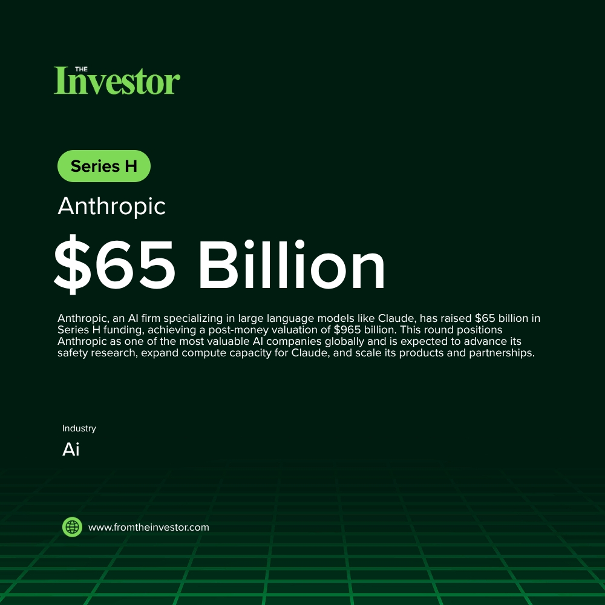

# Daily News Report (2026-05-30)

> Curated from TechCrunch and Hacker News. Contains 3 fundraising deals.
> Generated automatically via GitHub Actions.

---

## 1. Anthropic: $65 Billion Series H

- **Summary**: Anthropic, an AI firm specializing in large language models like Claude, has raised $65 billion in Series H funding, achieving a post-money valuation of $965 billion. This round positions Anthropic as one of the most valuable AI companies globally and is expected to advance its safety research, expand compute capacity for Claude, and scale its products and partnerships.
- **Key Points**:
  1. Investors: Altimeter Capital, Dragoneer, Greenoaks, Sequoia Capital, Capital Group, Coatue, D1 Capital Partners, GIC, ICONIQ, XN, AMP PBC, Baillie Gifford, Blackstone, Brookfield, D.E. Shaw Ventures, DST Global, Fidelity Management & Research Company, General Catalyst, Insight Partners, Jane Street, Lightspeed Venture Partners, MGX, NTTVC, NX1 Capital, Situational Awareness LP, T. Rowe Price Associates, Inc., T. Rowe Price Investment Management, Inc., Temasek, Amazon, Micron, Samsung, SK Hynix
  2. Sector keywords: AI, Large Language Models, Generative AI, Series H, Valuation
- **Source**: [The Hill](https://thehill.com/policy/technology/5900111-anthropic-valuation-openai-race/)
- **Generated Card**: [View Rendered Image](https://templated-assets.s3.amazonaws.com/render/e7ce31e9-1f00-48d6-8f30-ae0f4b43fd68.jpg)

- **Keywords**: `AI` `Large Language Models` `Generative AI` `Series H` `Valuation`
- **Score**: ⭐⭐⭐⭐⭐ (5/5)

---

## 2. Groq: $650 Million in internal funding

- **Summary**: Groq, an AI chip startup, is reportedly raising $650 million in internal funding to pivot its focus from hardware to AI inference. This strategic shift aims to refine how AI models respond to prompted requests, accelerating low-latency and cost-effective model deployments across various industries.
- **Key Points**:
  1. Investors: Undisclosed
  2. Sector keywords: AI, Chips, Inference, Hardware
- **Source**: [TechCrunch](https://techcrunch.com/2026/05/29/after-nvidias-20b-not-acqui-hire-ai-chip-startup-groq-reportedly-raising-650m/)
- **Keywords**: `AI` `Chips` `Inference` `Hardware`
- **Score**: ⭐⭐⭐⭐ (4/5)

---

## 3. Corgi: $106 Million Series B1

- **Summary**: Corgi, an AI-powered commercial insurance platform based in San Francisco, raised $106 million in a Series B1 funding round. This latest capital infusion will support the expansion of its full-stack insurance platform and the launch of new commercial insurance products across various industries, aiming to modernize a technologically outdated sector.
- **Key Points**:
  1. Investors: TCV, Prime Capital, Zone 2 Ventures, Oliver Jung, Leblon Capital, Kindred Ventures, Quadri Ventures, First Order Fund, Vocal Ventures, Nordstar, GSBackers, Repeat Ventures, 8188 Capital
  2. Sector keywords: Insurtech, AI, Commercial Insurance, SaaS
- **Source**: [Tech Funding News](https://techfundingnews.com/yc-unicorn-corgi-doubles-valuation-to-2-6b-in-three-weeks-with-106m-raise-to-modernise-commercial-insurance/)
- **Keywords**: `Insurtech` `AI` `Commercial Insurance` `SaaS`
- **Score**: ⭐⭐⭐ (3/5)

---

*Generated by Daily News Report v3.0*
