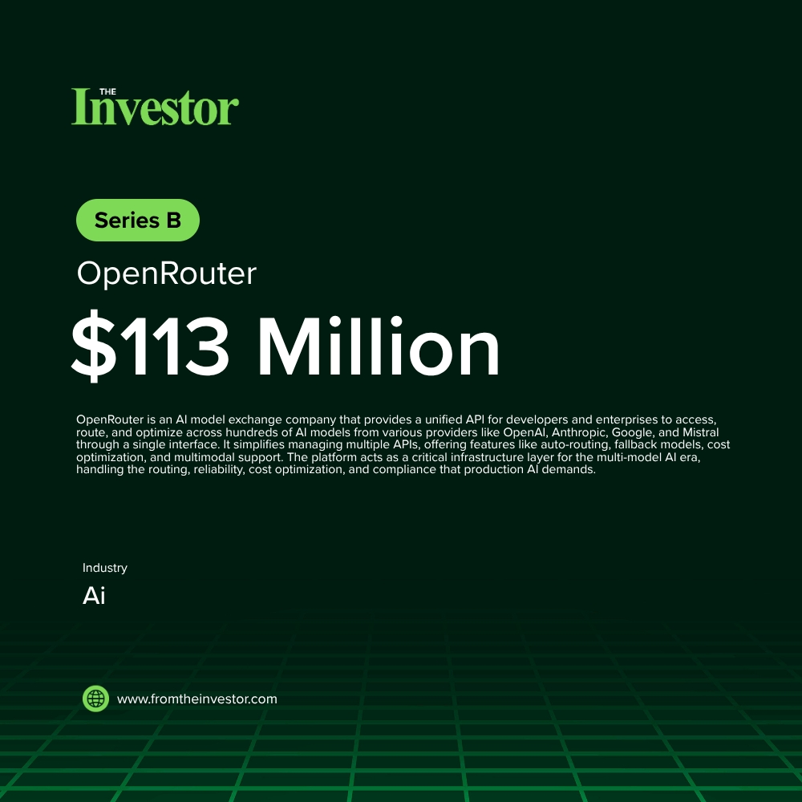

# Daily News Report (2026-05-31)

> Curated from TechCrunch and Hacker News. Contains 1 fundraising deals.
> Generated automatically via GitHub Actions.

---

## 1. OpenRouter: $113M Series B

- **Summary**: OpenRouter is an AI model exchange company that provides a unified API for developers and enterprises to access, route, and optimize across hundreds of AI models from various providers like OpenAI, Anthropic, Google, and Mistral through a single interface. It simplifies managing multiple APIs, offering features like auto-routing, fallback models, cost optimization, and multimodal support. The platform acts as a critical infrastructure layer for the multi-model AI era, handling the routing, reliability, cost optimization, and compliance that production AI demands.
- **Key Points**:
  1. Investors: CapitalG, NVentures, ServiceNow Ventures, MongoDB Ventures, Snowflake Ventures, Databricks Ventures, AMP PBC, Pace Capital, Andreessen Horowitz, Menlo Ventures
  2. Sector keywords: AI infrastructure, LLM, API, AI models
- **Source**: [Hacker News](https://openrouter.ai/announcements/series-b)
- **Generated Card**: [View Rendered Image](https://templated-assets.s3.amazonaws.com/render/a5913f3c-beb0-497f-a579-d1507e867735.jpg)

- **Keywords**: `AI infrastructure, LLM, API, AI models`
- **Score**: ⭐⭐⭐⭐⭐ (5/5)

---

*Generated by Daily News Report v3.0*
