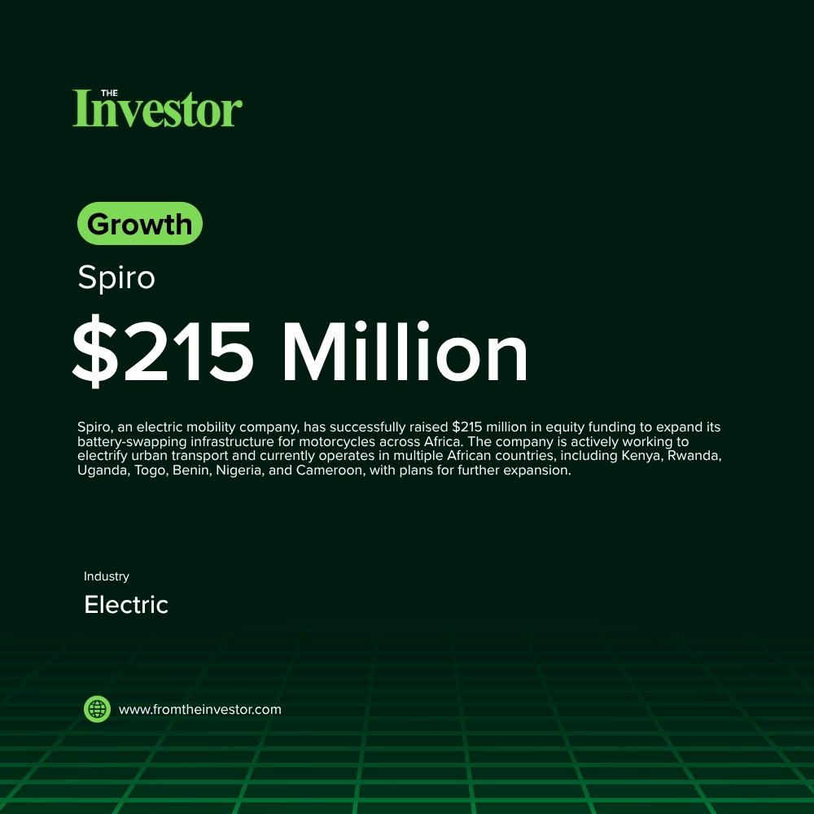

# Daily News Report (2026-06-01)

> Curated from TechCrunch and Hacker News. Contains 1 fundraising deals.
> Generated automatically via GitHub Actions.

---

## 1. Spiro: $215 million in equity funding

- **Summary**: Spiro, an electric mobility company, has successfully raised $215 million in equity funding to expand its battery-swapping infrastructure for motorcycles across Africa. The company is actively working to electrify urban transport and currently operates in multiple African countries, including Kenya, Rwanda, Uganda, Togo, Benin, Nigeria, and Cameroon, with plans for further expansion.
- **Key Points**:
  1. Investors: Impact Fund Denmark, Equitane
  2. Sector keywords: electric mobility, EV, battery-swapping, Africa, clean energy
- **Source**: [TechCabal](https://techcabal.com/2026/06/01/spiro-raises-215-million-to-expand/)
- **Generated Card**: [View Rendered Image](https://templated-assets.s3.amazonaws.com/render/6cb0bba5-a6fc-4e5b-b87b-b6591f689ad6.jpg)

- **Keywords**: `electric mobility, EV, battery-swapping, Africa, clean energy`
- **Score**: ⭐⭐⭐⭐⭐ (5/5)

---

*Generated by Daily News Report v3.0*
