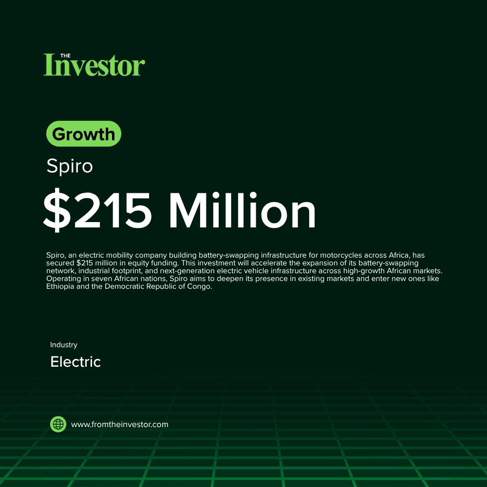

# Daily News Report (2026-06-02)

> Curated from TechCrunch and Hacker News. Contains 2 fundraising deals.
> Generated automatically via GitHub Actions.

---

## 1. Spiro: $215 Million Equity Funding

- **Summary**: Spiro, an electric mobility company building battery-swapping infrastructure for motorcycles across Africa, has secured $215 million in equity funding. This investment will accelerate the expansion of its battery-swapping network, industrial footprint, and next-generation electric vehicle infrastructure across high-growth African markets. Operating in seven African nations, Spiro aims to deepen its presence in existing markets and enter new ones like Ethiopia and the Democratic Republic of Congo.
- **Key Points**:
  1. Investors: Impact Fund Denmark, Equitane
  2. Sector keywords: Electric Vehicles, E-mobility, Battery Swapping, Africa, Clean Energy
- **Source**: [TechCabal](https://techcabal.com/2026/06/01/spiro-raises-215-million-to-expand/)
- **Generated Card**: [View Rendered Image](https://templated-assets.s3.amazonaws.com/render/f815eeec-4e80-4fc4-90ff-1bcf953e39a9.jpg)

- **Keywords**: `Electric Vehicles, E-mobility, Battery Swapping, Africa, Clean Energy`
- **Score**: ⭐⭐⭐⭐⭐ (5/5)

---

## 2. Gigascale Capital: $250 Million Fund

- **Summary**: Gigascale Capital, a venture firm founded by former Meta CTO Mike Schroepfer, closed its first institutional climate fund at $250 million. The fund focuses on investing in early-stage founders who are rebuilding the physical economy across energy, grid infrastructure, critical minerals, and industrial technologies. The firm's investment thesis emphasizes backing companies that deliver cheaper, faster, and more reliable products and services, with climate impact arising as a natural outcome of better-performing systems.
- **Key Points**:
  1. Investors: Undisclosed
  2. Sector keywords: Venture Capital, Climate Tech, Fundraise, Energy Infrastructure
- **Source**: [TechCrunch](https://techcrunch.com/2026/06/01/zigging-when-most-are-zagging-ex-meta-cto-raises-250m-climate-fund/)
- **Keywords**: `Venture Capital, Climate Tech, Fundraise, Energy Infrastructure`
- **Score**: ⭐⭐⭐⭐ (4/5)

---

*Generated by Daily News Report v3.0*
