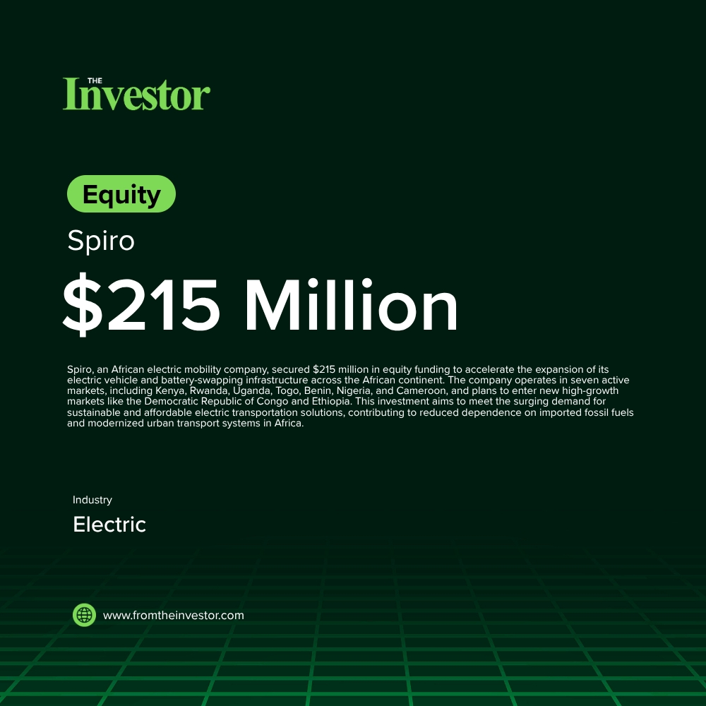

# Daily News Report (2026-06-03)

> Curated from TechCrunch and Hacker News. Contains 3 fundraising deals.
> Generated automatically via GitHub Actions.

---

## 1. Spiro: $215 Million Equity

- **Summary**: Spiro, an African electric mobility company, secured $215 million in equity funding to accelerate the expansion of its electric vehicle and battery-swapping infrastructure across the African continent. The company operates in seven active markets, including Kenya, Rwanda, Uganda, Togo, Benin, Nigeria, and Cameroon, and plans to enter new high-growth markets like the Democratic Republic of Congo and Ethiopia. This investment aims to meet the surging demand for sustainable and affordable electric transportation solutions, contributing to reduced dependence on imported fossil fuels and modernized urban transport systems in Africa.
- **Key Points**:
  1. Investors: Impact Fund Denmark, Equitane, FEDA (long-standing investor)
  2. Sector keywords: electric vehicles, e-mobility, battery-swapping, Africa, sustainability, infrastructure, climate tech
- **Source**: [TechCabal](https://techcabal.com/2026/06/02/techcabal-daily-brass-gets-stacked/)
- **Generated Card**: [View Rendered Image](https://templated-assets.s3.amazonaws.com/render/c0c39a36-46f1-4d04-b2e0-5f93a8731161.jpg)

- **Keywords**: `electric vehicles, e-mobility, battery-swapping, Africa, sustainability, infrastructure, climate tech`
- **Score**: ⭐⭐⭐⭐⭐ (5/5)

---

## 2. Archestra.AI: $10 Million Seed

- **Summary**: Archestra.AI, a London-based startup, raised $10 million in a Seed funding round to build an open-source platform that securely connects AI agents to sensitive corporate data. The company's technology aims to provide essential guardrails and governance, enabling enterprises to safely integrate AI into legal, managerial, procurement, and operations workflows without risking data exfiltration. The platform addresses the critical need for secure AI agent deployment as companies move from pilot programs to production.
- **Key Points**:
  1. Investors: 20VC (lead), 20 Product, Visible Ventures, Tenacity Capital, Commit Fund, Olivier Pomel (CEO of Datadog), Kieran Flanagan (SVP of Agentic GTM and Systems at HubSpot), Carolyn Everson (Permira board member)
  2. Sector keywords: AI security, open-source, enterprise AI, data governance, cybersecurity, AI agents
- **Source**: [Hacker News](https://archestra.ai/blog/archestra-announces-10m-seed)
- **Keywords**: `AI security, open-source, enterprise AI, data governance, cybersecurity, AI agents`
- **Score**: ⭐⭐⭐ (3/5)

---

## 3. Rudus: Undisclosed Preseed

- **Summary**: Rudus, a Y Combinator (P26 batch) startup, launched its AI-powered platform for concrete contractors. The company's solution aims to revolutionize the concrete estimation process by significantly reducing the time spent on manual takeoffs and quantity calculations. Rudus helps estimators bid on 3-5 times more projects by providing faster, more accurate measurements and a streamlined workflow, integrating seamlessly with existing construction software.
- **Key Points**:
  1. Investors: Y Combinator
  2. Sector keywords: construction tech, AI, concrete, SaaS, estimation software, Y Combinator
- **Source**: [Hacker News](https://news.ycombinator.com/item?id=48374528)
- **Keywords**: `construction tech, AI, concrete, SaaS, estimation software, Y Combinator`
- **Score**: ⭐⭐ (2/5)

---

*Generated by Daily News Report v3.0*
