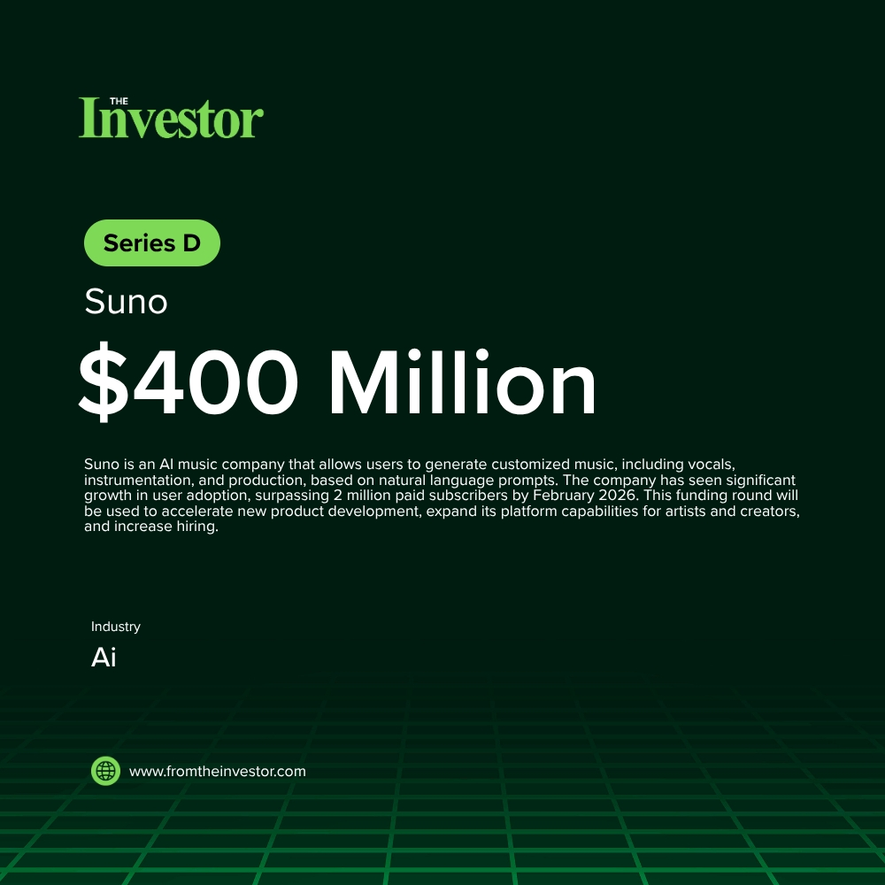

# Daily News Report (2026-06-04)

> Curated from TechCrunch and Hacker News. Contains 3 fundraising deals.
> Generated automatically via GitHub Actions.

---

## 1. Suno: $400 Million Series D

- **Summary**: Suno is an AI music company that allows users to generate customized music, including vocals, instrumentation, and production, based on natural language prompts. The company has seen significant growth in user adoption, surpassing 2 million paid subscribers by February 2026. This funding round will be used to accelerate new product development, expand its platform capabilities for artists and creators, and increase hiring.
- **Key Points**:
  1. Investors: Bond Capital (Lead), IVP, Forerunner, Union Square Ventures, Alkeon Capital Management, Quiet Capital, Matrix Partners, Lightspeed Venture Partners, Menlo Ventures, Schroders Capital
  2. Sector keywords: AI, Music Generation, Generative AI, Music Tech
- **Source**: [Suno.com](https://suno.com/blog/series-d-announcement)
- **Generated Card**: [View Rendered Image](https://templated-assets.s3.amazonaws.com/render/8dd41a39-9bf4-4ac4-a928-351c3ad6050d.jpg)

- **Keywords**: `AI, Music Generation, Generative AI, Music Tech`
- **Score**: ⭐⭐⭐⭐⭐ (5/5)

---

## 2. Impulse Space: $500 Million Series D

- **Summary**: Impulse Space is a California-based aerospace company, founded by former SpaceX employee Tom Mueller, that specializes in advanced in-space mobility. The company develops and operates vehicles like Mira, a precision maneuvering spacecraft, and Helios, a high-energy kick stage, which enable rapid, precise, and affordable movement of payloads after launch. The significant Series D funding will be utilized to expand hiring and manufacturing, scaling up the production of its spacecraft and propulsion systems.
- **Key Points**:
  1. Investors: 137 Ventures (Co-Lead), BANNER VC (Co-Lead), Founders Fund, Lux Capital, Linse Capital
  2. Sector keywords: Space, In-space mobility, Aerospace, Propulsion, Deep Tech
- **Source**: [Arstechnica.com](https://arstechnica.com/space/2026/06/impulse-space-raises-500-million-as-orbital-maneuvering-race-heats-up/)
- **Keywords**: `Space, In-space mobility, Aerospace, Propulsion, Deep Tech`
- **Score**: ⭐⭐⭐⭐⭐ (5/5)

---

## 3. Hyper: Undisclosed Seed

- **Summary**: Hyper is a Y Combinator Spring 2026 batch startup that is building an AI-powered 'company brain'. This system silently learns from all company updates across various tools (e.g., Notion, Slack, GitHub) and synthesizes this information into real-time, shareable knowledge. This knowledge is then integrated into existing AI tools, aiming to make the entire company smarter.
- **Key Points**:
  1. Investors: Y Combinator
  2. Sector keywords: AI, Developer Tools, Productivity, Agentic AI, SaaS
- **Source**: [Hacker News](https://news.ycombinator.com/item?id=48387095)
- **Keywords**: `AI, Developer Tools, Productivity, Agentic AI, SaaS`
- **Score**: ⭐⭐⭐ (3/5)

---

*Generated by Daily News Report v3.0*
