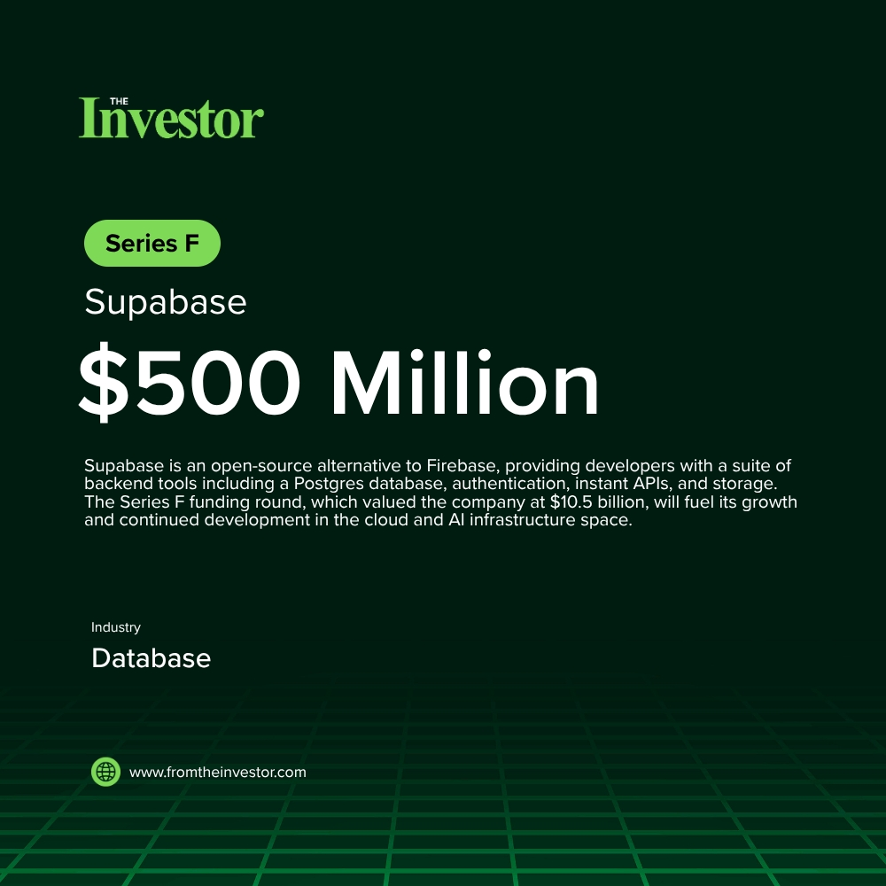

# Daily News Report (2026-06-05)

> Curated from TechCrunch and Hacker News. Contains 3 fundraising deals.
> Generated automatically via GitHub Actions.

---

## 1. Supabase: $500 Million Series F at $10.5 Billion valuation

- **Summary**: Supabase is an open-source alternative to Firebase, providing developers with a suite of backend tools including a Postgres database, authentication, instant APIs, and storage. The Series F funding round, which valued the company at $10.5 billion, will fuel its growth and continued development in the cloud and AI infrastructure space.
- **Key Points**:
  1. Investors: Lightspeed Venture Partners, Coatue, Insight Partners, Andreessen Horowitz (a16z), Felicis Ventures
  2. Sector keywords: database, backend-as-a-service, open-source, developer-tools
- **Source**: [Supabase](https://supabase.com/blog/supabase-series-f)
- **Generated Card**: [View Rendered Image](https://templated-assets.s3.amazonaws.com/render/158be676-2979-468f-98a6-6330868b1b4a.jpg)

- **Keywords**: `database` `backend-as-a-service` `open-source` `developer-tools`
- **Score**: ⭐⭐⭐⭐⭐ (5/5)

---

## 2. Ramp: $750 Million Series F at $44 Billion valuation

- **Summary**: Ramp is a corporate spend-management platform offering corporate cards and finance automation tools. The company achieved a $44 billion valuation with this $750 million Series F funding, which will be used to further invest in AI capabilities, including AI token cost management and accounting. Ramp has surpassed $1 billion in annual revenue and serves over 70,000 customers.
- **Key Points**:
  1. Investors: ICONIQ, GIC, Ontario Teachers' Pension Plan (lead investors); Goldman Sachs Alternatives, D.E. Shaw & Co., Morgan Stanley Investment Management, Generation Investment Management, Insight Partners, BroadLight Capital (new investors); Founders Fund, Lightspeed, D1 Capital Partners, T. Rowe Price, General Catalyst, 137 Ventures, Thrive Capital, Coatue, Khosla Ventures (returning investors)
  2. Sector keywords: Fintech, AI, spend-management, corporate-cards
- **Source**: [TechCrunch](https://techcrunch.com/2026/06/04/ramp-raises-750m-at-44b-valuation-as-investors-hunger-for-fintechs-with-an-ai-story/)
- **Keywords**: `Fintech` `AI` `spend-management` `corporate-cards`
- **Score**: ⭐⭐⭐⭐⭐ (5/5)

---

## 3. Starcloud: $170 Million Series A at $1.1 Billion valuation

- **Summary**: Starcloud is a Redmond, WA-based startup building space-based data centers powered by solar energy, with a long-term vision for an 88,000-satellite constellation. They raised a $170 million Series A round, achieving a $1.1 billion valuation and becoming the fastest Y Combinator company to reach unicorn status. The company has already launched a satellite with an Nvidia H100 GPU and successfully trained an AI model in orbit.
- **Key Points**:
  1. Investors: Benchmark, EQT Ventures (lead investors); Macquarie Capital, NFX, Nebular, Y Combinator, Adjacent, 776 Ventures, Fuse Ventures, Manhattan West, Monolith Power Systems, 3C AGI Partners, Batch Ventures, Carya, Gsbackers, Harpoon, Link Ventures, New Vista Capital, Phosphor (other investors); Angel investors included Stephen Wilson, Dennis Muilenburg, Kevin Johnson
  2. Sector keywords: Space-tech, AI-infrastructure, data-centers, orbital-computing
- **Source**: [GeekWire](https://www.geekwire.com/2026/orbital-ai-seattle-area-startup-starcloud-hits-1-1b-valuation-to-build-space-based-data-centers/)
- **Keywords**: `Space-tech` `AI-infrastructure` `data-centers` `orbital-computing`
- **Score**: ⭐⭐⭐⭐⭐ (5/5)

---

*Generated by Daily News Report v3.0*
