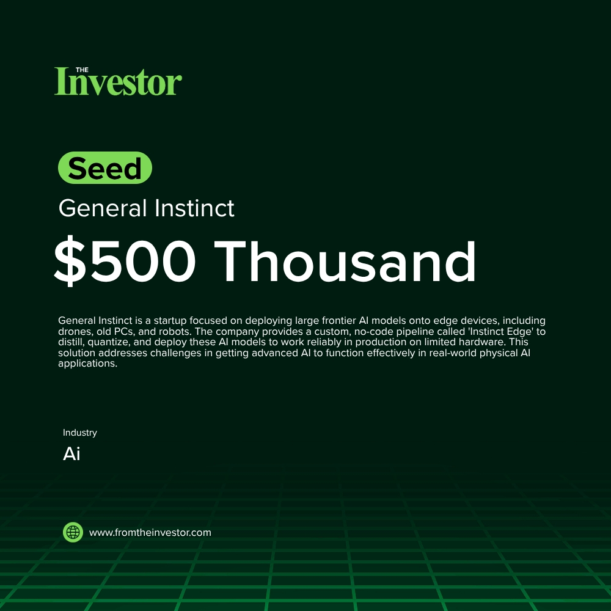

# Daily News Report (2026-06-06)

> Curated from TechCrunch and Hacker News. Contains 1 fundraising deals.
> Generated automatically via GitHub Actions.

---

## 1. General Instinct: $500 Thousand Seed (Y Combinator P26)

- **Summary**: General Instinct is a startup focused on deploying large frontier AI models onto edge devices, including drones, old PCs, and robots. The company provides a custom, no-code pipeline called 'Instinct Edge' to distill, quantize, and deploy these AI models to work reliably in production on limited hardware. This solution addresses challenges in getting advanced AI to function effectively in real-world physical AI applications.
- **Key Points**:
  1. Investors: Y Combinator
  2. Sector keywords: AI, Edge Computing, Machine Learning, Robotics, Infrastructure
- **Source**: [Hacker News](https://news.ycombinator.com/item?id=48414869)
- **Generated Card**: [View Rendered Image](https://templated-assets.s3.amazonaws.com/render/b7dea918-53eb-4a39-9326-fedfcc36f960.jpg)

- **Keywords**: `AI, Edge Computing, Machine Learning, Robotics, Infrastructure`
- **Score**: ⭐⭐⭐ (3/5)

---

*Generated by Daily News Report v3.0*
